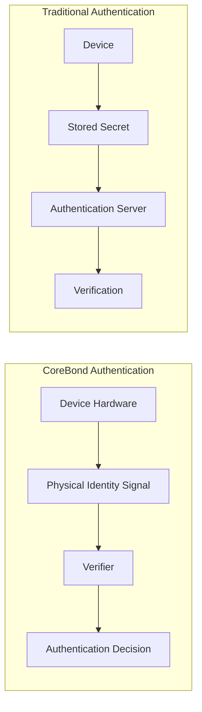

# CoreBond Architecture

Exploration of a hardware-rooted device identity model designed to eliminate stored credentials in IoT authentication systems.
## Status

This repository documents the conceptual architecture behind the CoreBond device identity model.

The goal is to explore authentication systems that eliminate stored credentials and traditional key exchange in IoT environments.

This repository focuses on architecture and security model discussion rather than production implementation.
## Concept
CoreBond derives device identity from intrinsic physical characteristics of hardware rather than stored credentials.

## Goals
- Remove stored secrets from device authentication
- Reduce credential extraction risk
- Simplify trust models in large IoT deployments
## Traditional Device Authentication

Most IoT systems rely on stored credentials.

Device → Stored Secret → Authentication Server → Verification

If the secret is extracted, the device identity can be cloned.

---

## CoreBond Concept

CoreBond explores deriving identity from intrinsic physical characteristics of the device rather than stored credentials.

Device → Physical Identity Signal → Verifier → Authentication Decision

No stored secret  
No key exchange

## Traditional vs CoreBond Authentication
The following diagrams compare traditional stored-credential authentication with the CoreBond identity model.

## Security Assumptions

The CoreBond model assumes the following conditions:

• Device hardware characteristics produce stable, measurable identity signals.  
• The verifier can observe or measure these signals with sufficient fidelity.  
• Attackers may gain firmware access or limited physical access to a device.  
• Attackers cannot easily reproduce the intrinsic physical characteristics of the original hardware.
## Threat Model Considerations
CoreBond explores architectures intended to reduce risks associated with
credential extraction and device cloning.

This model assumes attackers may gain firmware access or physical access
to devices and therefore focuses on removing stored credentials that could
be extracted and reused.

Further research is required to evaluate resilience against:
• signal replay
• environmental variation
• side-channel observation
